<!-- rayanalpha / profile README -->

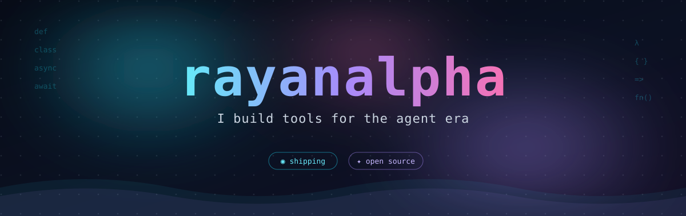

<p align="center">
  
</p>

<p align="center">
  
  <a href="https://github.com/rayanalpha?tab=followers"></a>
  
</p>


## 👨‍💻 About me

```python
class RayanAlpha:
    def __init__(self):
        self.role      = "Software Engineer"
        self.home      = "Tehran, IR  (UTC+3:30)"
        self.languages = ["Python", "JavaScript", "TypeScript"]
        self.stack     = ["FastAPI", "React/Next.js", "Docker", "PostgreSQL", "Redis", "Celery"]
        self.obsessed_with = ["developer tools", "security", "automation", "AI agents"]
        self.currently = "shipping something new every single day"
        self.fun_fact  = "my contribution graph never really sleeps"

    def motto(self):
        return "Build in public. Harden everything. Automate the rest."
```

> I design and ship **developer tools, security utilities and automation systems** — mostly in Python,
> with a growing JavaScript footprint. Everything I publish is **public, tested and hardened**:
> quality gates, independent red-team review, signed releases.

## 🛠️ Tech stack

<p align="center">
  
</p>

<p align="center">
  
  
  
  
  
</p>


## 🚀 Featured builds

<!-- Two-up on desktop, wraps gracefully on narrow screens — no horizontal scroll. -->
<p align="center">
  <a href="https://github.com/rayanalpha/mantrap">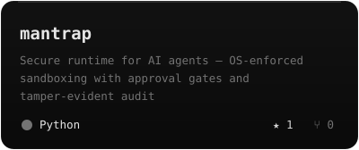</a><a href="https://github.com/rayanalpha/brushpass">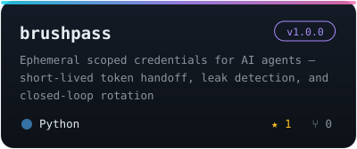</a><br/>
  <a href="https://github.com/rayanalpha/fresheyes">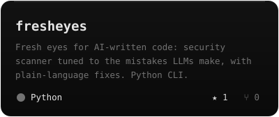</a><a href="https://github.com/rayanalpha/spendfence">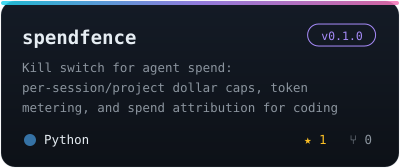</a><br/>
  <a href="https://github.com/rayanalpha/logline">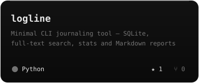</a><a href="https://github.com/rayanalpha/factor">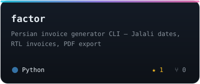</a><br/>
  <a href="https://github.com/rayanalpha/Instareel">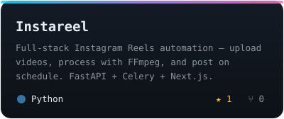</a><a href="https://github.com/rayanalpha?tab=repositories">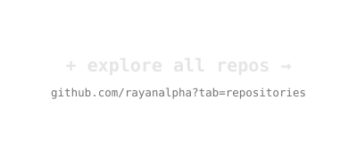</a>
</p>


## 📈 Analytics

<p align="center">
  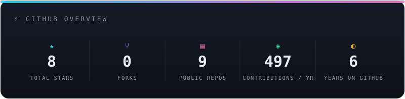
</p>

<p align="center">
  
</p>

<p align="center">
  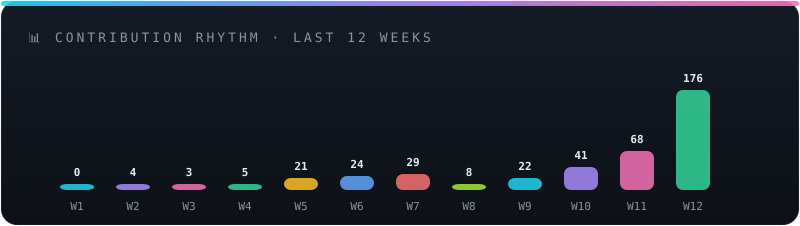
</p>

<p align="center">
  
</p>

> Cards above are **generated in-repo** — no third-party stats service.
> They rebuild every morning via [`.github/workflows/cards.yml`](.github/workflows/cards.yml).

## 🐍 Watch me work

<picture>
  <source media="(prefers-color-scheme: dark)" srcset="https://raw.githubusercontent.com/rayanalpha/rayanalpha/output/github-snake-dark.svg"/>
  <source media="(prefers-color-scheme: light)" srcset="https://raw.githubusercontent.com/rayanalpha/rayanalpha/output/github-snake.svg"/>
  
</picture>


## 🎯 Right now

- 🔨 **Building daily** — one hardened release at a time, every project versioned on GitHub
- 🧪 **Quality ritual** — pytest green, ruff clean, red-team review, SSH-signed tags before any release
- 💡 **Idea pipeline** — harvesting ambitious project ideas daily from GitHub Trending, HN, Reddit & Product Hunt
- 🌙 **Nightly loops** — automated strengthening passes keep every repo sharp while I sleep

## 📫 Connect

<p align="center">
  <a href="https://github.com/rayanalpha"></a>
  <a href="https://t.me/SameOldAryan"></a>
  <a href="https://instagram.com/th3.rayan"></a>
</p>

<p align="center">
  <i>“Talk is cheap. Ship the release.”</i>
</p>


